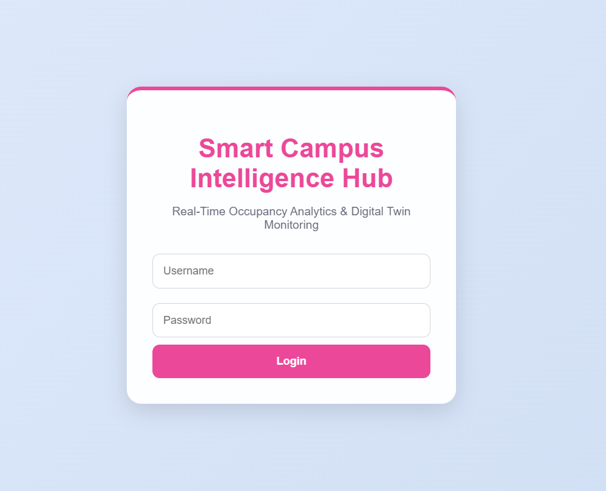
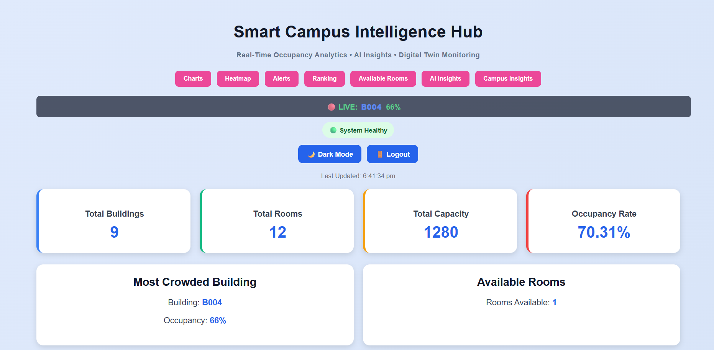
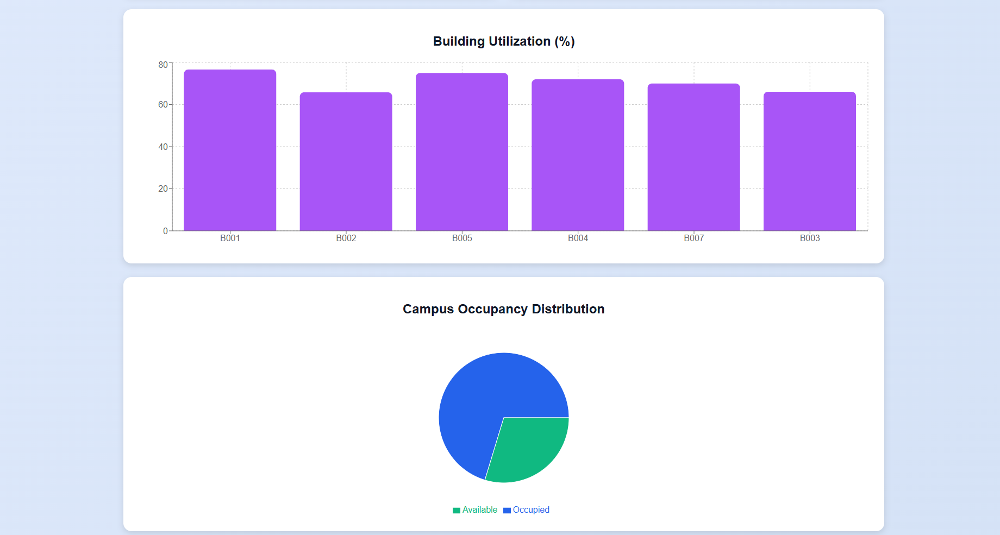
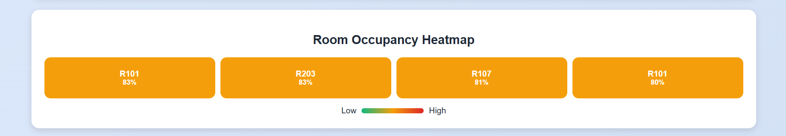
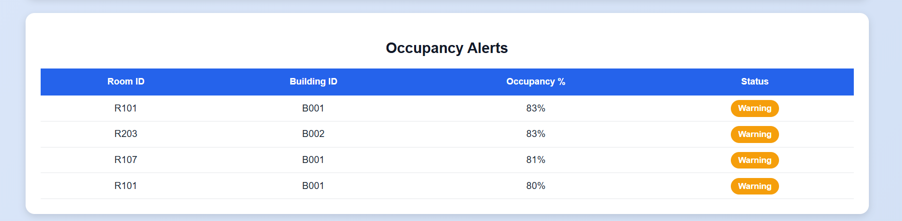
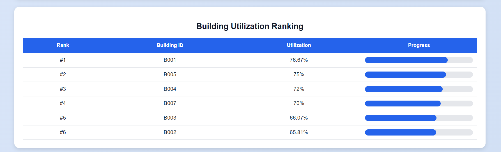
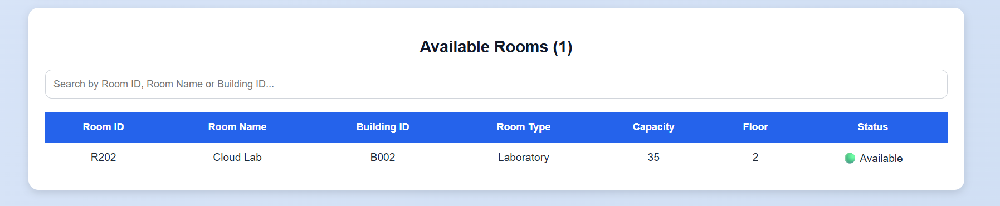
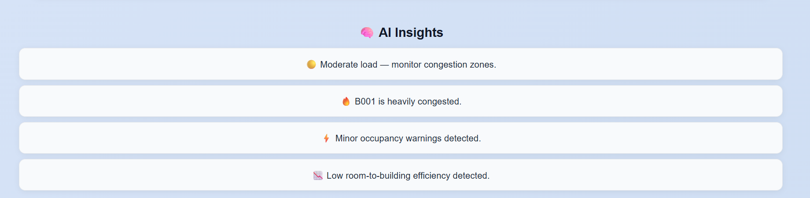
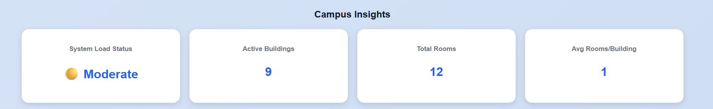

# Smart Campus Intelligence Hub

Smart Campus Intelligence Hub is a cloud-powered digital twin platform developed to monitor, analyze, and optimize campus operations in real time. The system provides a virtual representation of campus infrastructure by combining occupancy analytics, building utilization monitoring, AI-generated insights, and live event streaming. Through the integration of cloud computing and interactive visualizations, the platform enables administrators to gain operational visibility, improve resource allocation, and respond quickly to changing campus conditions. The project demonstrates how digital twin technology can be applied to educational environments to support intelligent decision-making and efficient facility management.

## Key Features

* Real-Time Occupancy Monitoring
* Building Utilization Analytics
* Occupancy Distribution Visualization
* Room Occupancy Heatmap
* Smart Occupancy Alerts
* Building Ranking Analysis
* Available Room Detection
* AI-Generated Insights
* WebSocket-Based Live Updates
* Dark Mode Support
* Secure Login Interface
* AWS Cloud Integration

## System Overview

The platform continuously processes occupancy information and transforms it into meaningful analytics through a centralized dashboard. Campus facilities are represented digitally, allowing administrators to monitor room usage, building occupancy levels, and resource availability from a single interface. Instead of relying on manual reporting, the system automatically updates occupancy statistics and generates visual insights that help identify utilization patterns across campus infrastructure. By combining analytics with real-time updates, the platform improves situational awareness and enables faster operational decisions.

## System Architecture

The application follows a modern cloud-native architecture consisting of a frontend analytics dashboard, a backend processing layer, cloud services, and a real-time communication layer. The frontend is built using React.js and provides interactive visualizations through Recharts. The backend is developed using Node.js and Express.js and is responsible for handling analytics requests and data processing operations. AWS Lambda functions execute serverless workloads, Amazon API Gateway manages secure API communication, and Amazon DynamoDB stores occupancy and building information. Real-time updates are delivered through Socket.IO and WebSocket communication, ensuring that users always have access to the latest operational data without requiring manual page refreshes.

## Dashboard Modules

The dashboard is composed of several analytical modules that together provide a complete view of campus activity. The Dashboard Overview presents high-level metrics such as occupancy rates, room availability, and system status. Building Utilization Analytics allows users to compare utilization levels across facilities and identify highly occupied structures. Occupancy Distribution visualizes campus-wide capacity usage, while the Room Occupancy Heatmap provides a color-coded representation of room activity levels. Additional modules include Occupancy Alerts for threshold monitoring, Building Ranking for performance comparison, Available Rooms for resource allocation, AI Insights for automated recommendations, and Campus Insights for operational KPI tracking. Each module contributes to a comprehensive digital twin representation of the campus environment.

## Real-Time Analytics

A key feature of the platform is its ability to provide live operational visibility through WebSocket communication. Whenever occupancy conditions change, the dashboard is updated automatically without requiring user intervention. This real-time capability ensures that administrators receive immediate awareness of congestion events, occupancy fluctuations, and system alerts. By reducing latency between data generation and visualization, the platform supports proactive decision-making and improves responsiveness during high-demand periods.

## User Interface and Experience

The interface is designed to provide a clean and intuitive user experience while maintaining a professional analytical appearance. Interactive charts, heatmaps, ranking systems, and KPI cards allow users to quickly interpret large amounts of information. The addition of dark mode improves accessibility and usability in different environments, while the login interface provides a secure entry point into the system. Navigation features enable users to move efficiently between analytical sections and focus on the information most relevant to their tasks.

## Technologies Used

| Category                | Technologies               |
| ----------------------- | -------------------------- |
| Frontend                | React.js, JavaScript, CSS3 |
| Visualization           | Recharts                   |
| Backend                 | Node.js, Express.js        |
| Real-Time Communication | Socket.IO                  |
| Cloud Services          | AWS Lambda, API Gateway    |
| Database                | Amazon DynamoDB            |

## Screenshots

### Login Page

### Full Dashboard

### Analytics Charts

### Occupancy Heatmap

### Occupancy Alerts

### Building Ranking

### Available Rooms

### AI Insights

### Campus Insights

## Future Enhancements

Future versions of the platform may incorporate predictive occupancy forecasting, machine learning-based recommendation systems, IoT sensor integration, automated report generation, and mobile application support. Additional enhancements such as role-based access control, multi-campus management, and advanced trend analytics can further improve scalability and operational effectiveness. These improvements would enable the platform to evolve from a monitoring solution into a comprehensive intelligent campus management ecosystem.

## Project Impact

Smart Campus Intelligence Hub demonstrates how digital twin technology, cloud computing, and real-time analytics can be integrated to create intelligent monitoring systems for educational institutions. By providing visibility into campus utilization patterns and operational performance, the platform helps support efficient resource management, informed planning, and proactive decision-making.

---
*Built for intelligent campus monitoring, digital twin analytics, and real-time decision support.*
